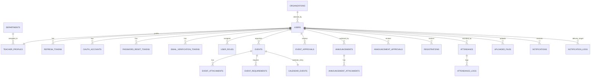
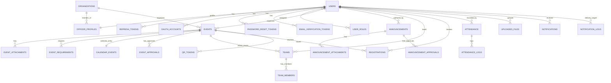
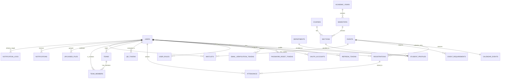

## Admin

```mermaid
erDiagram
    %% Admin - Module Connections

    USERS ||--|| ADMINISTRATOR_PROFILES : "profile"
    USERS ||--o{ REFRESH_TOKENS : "has"
    USERS ||--o{ OAUTH_ACCOUNTS : "has"
    USERS ||--o{ PASSWORD_RESET_TOKENS : "has"
    USERS ||--o{ EMAIL_VERIFICATION_TOKENS : "has"
    USERS }o--o{ USER_ROLES : "assigned"
    ROLES }o--o{ USER_ROLES : "assigned_to"
    ROLES }o--o{ ROLE_PERMISSIONS : "has"
    PERMISSIONS }o--o{ ROLE_PERMISSIONS : "granted_to"
    USERS ||--o{ EVENTS : "organizes"
    USERS ||--o{ EVENT_APPROVALS : "reviews"
    USERS ||--o{ ANNOUNCEMENTS : "authored_by"
    USERS ||--o{ ANNOUNCEMENT_APPROVALS : "reviews"
    USERS ||--o{ REGISTRATIONS : "reviews"
    USERS ||--o{ ATTENDANCE : "recorded_by"
    USERS ||--o{ UPLOADED_FILES : "uploads"
    USERS ||--o{ NOTIFICATIONS : "receives"
    USERS ||--o{ NOTIFICATION_LOGS : "delivery_target"
    USERS ||--o{ AUDIT_LOGS : "performed_by"
```

## Teacher

```mermaid
erDiagram
    %% Teacher - Module Connections

    USERS ||--|| TEACHER_PROFILES : "profile"
    DEPARTMENTS ||--o{ TEACHER_PROFILES : "assigned_to"
    USERS ||--o{ REFRESH_TOKENS : "has"
    USERS ||--o{ OAUTH_ACCOUNTS : "has"
    USERS ||--o{ PASSWORD_RESET_TOKENS : "has"
    USERS ||--o{ EMAIL_VERIFICATION_TOKENS : "has"
    USERS }o--o{ USER_ROLES : "assigned"
    ORGANIZATIONS ||--o{ USERS : "advised_by"
    USERS ||--o{ EVENTS : "organizes"
    EVENTS ||--o{ EVENT_ATTACHMENTS : "has"
    EVENTS ||--o{ EVENT_REQUIREMENTS : "requires"
    EVENTS ||--|| CALENDAR_EVENTS : "calendar_entry"
    USERS ||--o{ EVENT_APPROVALS : "reviews"
    USERS ||--o{ ANNOUNCEMENTS : "authored_by"
    ANNOUNCEMENTS ||--o{ ANNOUNCEMENT_ATTACHMENTS : "has"
    USERS ||--o{ ANNOUNCEMENT_APPROVALS : "reviews"
    USERS ||--o{ REGISTRATIONS : "reviews"
    USERS ||--o{ ATTENDANCE : "recorded_by"
    ATTENDANCE ||--o{ ATTENDANCE_LOGS : "logs"
    USERS ||--o{ UPLOADED_FILES : "uploads"
    USERS ||--o{ NOTIFICATIONS : "receives"
    USERS ||--o{ NOTIFICATION_LOGS : "delivery_target"
```

## Student Council

```mermaid
erDiagram
    %% Student Council (Officer) - Module Connections

    USERS ||--|| OFFICER_PROFILES : "profile"
    ORGANIZATIONS ||--o{ OFFICER_PROFILES : "member_of"
    USERS ||--o{ REFRESH_TOKENS : "has"
    USERS ||--o{ OAUTH_ACCOUNTS : "has"
    USERS ||--o{ PASSWORD_RESET_TOKENS : "has"
    USERS ||--o{ EMAIL_VERIFICATION_TOKENS : "has"
    USERS }o--o{ USER_ROLES : "assigned"
    ORGANIZATIONS ||--o{ EVENTS : "organizes"
    USERS ||--o{ EVENTS : "organizes"
    EVENTS ||--o{ EVENT_ATTACHMENTS : "has"
    EVENTS ||--o{ EVENT_REQUIREMENTS : "requires"
    EVENTS ||--|| CALENDAR_EVENTS : "calendar_entry"
    EVENTS ||--o{ EVENT_APPROVALS : "has_approvals"
    USERS ||--o{ ANNOUNCEMENTS : "authored_by"
    ANNOUNCEMENTS ||--o{ ANNOUNCEMENT_ATTACHMENTS : "has"
    ANNOUNCEMENTS ||--o{ ANNOUNCEMENT_APPROVALS : "has_approvals"
    EVENTS ||--o{ TEAMS : "allows_teams"
    USERS ||--o{ TEAMS : "leads"
    TEAMS ||--o{ TEAM_MEMBERS : "has_members"
    EVENTS ||--o{ REGISTRATIONS : "receives"
    USERS ||--o{ REGISTRATIONS : "reviews"
    USERS ||--o{ ATTENDANCE : "recorded_by"
    ATTENDANCE ||--o{ ATTENDANCE_LOGS : "logs"
    EVENTS ||--o{ QR_TOKENS : "issues"
    USERS ||--o{ UPLOADED_FILES : "uploads"
    USERS ||--o{ NOTIFICATIONS : "receives"
    USERS ||--o{ NOTIFICATION_LOGS : "delivery_target"
```

## Student

```mermaid
erDiagram
    %% Student - Module Connections

    USERS ||--|| STUDENT_PROFILES : "profile"
    DEPARTMENTS ||--o{ STUDENT_PROFILES : "enrolled_in"
    SECTIONS ||--o{ STUDENT_PROFILES : "enrolled_in"
    COURSES ||--o{ SECTIONS : "has"
    SEMESTERS ||--o{ SECTIONS : "contains"
    ACADEMIC_YEARS ||--o{ SEMESTERS : "contains"
    USERS ||--o{ REFRESH_TOKENS : "has"
    USERS ||--o{ OAUTH_ACCOUNTS : "has"
    USERS ||--o{ PASSWORD_RESET_TOKENS : "has"
    USERS ||--o{ EMAIL_VERIFICATION_TOKENS : "has"
    USERS }o--o{ USER_ROLES : "assigned"
    USERS ||--o{ REGISTRATIONS : "registers"
    EVENTS ||--o{ REGISTRATIONS : "receives"
    EVENTS ||--|| CALENDAR_EVENTS : "calendar_entry"
    EVENTS ||--o{ EVENT_REQUIREMENTS : "requires"
    REGISTRATIONS ||--o{ ATTENDANCE : "linked_to"
    USERS ||--o{ ATTENDANCE : "attends"
    USERS ||--o{ QR_TOKENS : "assigned_to"
    USERS ||--o{ TEAMS : "leads"
    USERS ||--o{ TEAM_MEMBERS : "is_member"
    TEAMS ||--o{ TEAM_MEMBERS : "has_members"
    EVENTS ||--o{ WAITLISTS : "has_waitlist"
    USERS ||--o{ WAITLISTS : "waitlisted"
    USERS ||--o{ UPLOADED_FILES : "uploads"
    USERS ||--o{ NOTIFICATIONS : "receives"
    USERS ||--o{ NOTIFICATION_LOGS : "delivery_target"
```
