# SchoolConnect — Database Architecture & Design

**Status:** Design phase (Phase 1 — Database Design). No backend code in this document; it defines schema, relationships, constraints, indexes, and the model-organization / migration strategy.

**Design decision (adopted):** Permission-based **RBAC**. Roles are collections of fine-grained permissions. Four seed roles ship by default (`admin`, `teacher`, `student_council`, `student`), but new roles (e.g. `registrar`, `guidance`, `club_adviser`) can be added without touching authorization logic — permissions are assigned to roles, users are assigned roles.

---

## 1. Naming Conventions

| Rule | Example |
| --- | --- |
| `snake_case` for tables, columns, indexes | `user_roles`, `created_at` |
| Plural table names | `users`, `events` |
| PK column always `id` (UUID) | `id UUID PK` |
| FK columns: `<singular>_id` | `event_id`, `student_id` |
| Audit/soft-delete columns on every major table | `created_at`, `updated_at`, `created_by`, `updated_by`, `deleted_at` |
| Join tables: alphabetical-ish `<a>_<b>` | `role_permissions`, `user_roles` |
| Enums stored as `TEXT` + `CHECK` (Postgres native `ENUM` is avoided for migration flexibility) | `status TEXT CHECK (...)` |
| Indexes: `ix_<table>_<column(s)>` | `ix_users_email` |
| Unique indexes: `uq_<table>_<column(s)>` | `uq_users_email` |
| Composite unique: `uq_<table>_<a>_<b>` | `uq_registrations_user_event` |

---

## 2. Global Columns (every major table)

Inherited from `BaseModel` (`app/models/base.py`):

- `id` UUID PK default `uuid_generate_v4()` (or `uuid.uuid4()`)
- `created_at` TIMESTAMPTZ NOT NULL default now()
- `updated_at` TIMESTAMPTZ NOT NULL default now() onupdate now()
- `created_by` UUID nullable (system actions may be null)
- `updated_by` UUID nullable
- `deleted_at` TIMESTAMPTZ nullable (soft delete; indexed)

Lookup / join tables that are pure plumbing (`role_permissions`, `user_roles`) omit soft-delete (their rows are not "business records"). Pivot tables for historical tracking (`team_members`, `attendance_logs`) keep audit columns.

---

## 3. Enumerations (stored as TEXT + CHECK)

```
user.status                 : active | inactive | suspended | invited
user.gender                : male | female | other | undisclosed
role.name                  : admin | teacher | student_council | student  (+ future custom)
registration_status.name   : pending | approved | rejected | waitlisted | cancelled | attended | absent
event.status               : draft | pending_approval | approved | ongoing | completed | cancelled | archived
announcement.priority      : normal | important | urgent
announcement.status        : draft | pending_approval | published | archived
approval.decision          : pending | approved | rejected
attendance.status          : present | absent | late | excused
notification.channel       : in_app | email | push
notification.status        : pending | sent | failed | read
notification_log.status    : sent | failed | bounced | opened
oauth_provider             : google  (+ future: microsoft, apple)
file.storage_backend       : local | cloudinary
team_member.role           : leader | member
```

---

## 4. Entity Relationship Diagram (Mermaid)

```mermaid
erDiagram
    %% RBAC
    users ||--o{ user_roles : "has"
    roles ||--o{ user_roles : "assigned_to"
    roles ||--o{ role_permissions : "grants"
    permissions ||--o{ role_permissions : "in"
    users ||--o{ refresh_tokens : "owns"
    users ||--o{ oauth_accounts : "links"
    users ||--o{ password_reset_tokens : "requests"
    users ||--o{ email_verification_tokens : "has"

    %% School structure
    departments ||--o{ courses : "offers"
    courses ||--o{ sections : "has"
    academic_years ||--o{ semesters : "contains"
    organizations ||--o{ users : "members"

    %% Profiles (1:1 with users)
    users ||--|| student_profiles : "is"
    users ||--|| teacher_profiles : "is"
    users ||--|| administrator_profiles : "is"
    users ||--|| officer_profiles : "is"
    departments ||--o{ student_profiles : "enrolled_in"
    sections ||--o{ student_profiles : "assigned"
    departments ||--o{ teacher_profiles : "belongs"

    %% Announcements
    announcement_categories ||--o{ announcements : "categorizes"
    users ||--o{ announcements : "authors"
    announcements ||--o{ announcement_attachments : "has"
    announcements ||--o{ announcement_approvals : "needs"
    users ||--o{ announcement_approvals : "approves"

    %% Events
    event_categories ||--o{ events : "categorizes"
    users ||--o{ events : "organizes"
    events ||--o{ event_attachments : "has"
    events ||--o{ event_requirements : "specifies"
    events ||--o{ event_approvals : "needs"
    users ||--o{ event_approvals : "approves"
    events ||--o{ calendar_events : "appears_in"

    %% Registration
    registration_statuses ||--o{ registrations : "defines"
    users ||--o{ registrations : "registers"
    events ||--o{ registrations : "for"
    teams ||--o{ team_members : "has"
    registrations ||--o{ team_members : "via"
    users ||--o{ team_members : "is"
    events ||--o{ waitlists : "has"
    users ||--o{ waitlists : "on"

    %% Attendance
    registrations ||--o{ attendance : "produces"
    events ||--o{ attendance : "for"
    users ||--o{ attendance : "of"
    qr_tokens ||--o{ attendance_logs : "scanned_in"
    attendance ||--o{ attendance_logs : "logged"
    users ||--o{ attendance_logs : "scanned_by"

    %% Notifications
    notification_templates ||--o{ notifications : "renders"
    users ||--o{ notifications : "receives"
    notifications ||--o{ notification_logs : "produces"

    %% Audit / uploads
    users ||--o{ audit_logs : "acted_by"
    users ||--o{ login_history : "for"
    users ||--o{ activity_logs : "performed_by"
    users ||--o{ uploaded_files : "uploaded_by"
    announcements ||--o{ uploaded_files : "references"
    events ||--o{ uploaded_files : "references"
```



---

## 5. Table-by-Table Schema

> Column notation: `name TYPE [NOT NULL] [DEFAULT] [PK|FK|UNIQUE|CHECK]`
> Audit columns (`id`, `created_at`, `updated_at`, `created_by`, `updated_by`, `deleted_at`) are implicit on every major table and omitted below for brevity except where noted.

### 5.1 Authentication

#### users
| Column | Type | Notes |
| --- | --- | --- |
| id | UUID | PK |
| email | CITEXT | NOT NULL, UNIQUE (`uq_users_email`) |
| username | VARCHAR(50) | UNIQUE (`uq_users_username`), nullable |
| password_hash | VARCHAR(255) | nullable (null for OAuth-only) |
| full_name | VARCHAR(150) | NOT NULL |
| first_name | VARCHAR(80) | nullable |
| last_name | VARCHAR(80) | nullable |
| status | TEXT | NOT NULL DEFAULT 'invited', CHECK in enum |
| email_verified | BOOLEAN | NOT NULL DEFAULT false |
| avatar_url | TEXT | nullable |
| phone | VARCHAR(30) | nullable |
| last_login_at | TIMESTAMPTZ | nullable |
| locale | VARCHAR(10) | DEFAULT 'en' |

Notes: `email` uses `CITEXT` for case-insensitive uniqueness. `password_hash` nullable supports Google-OAuth-only accounts.

#### roles
| Column | Type | Notes |
| --- | --- | --- |
| id | UUID | PK |
| name | VARCHAR(50) | NOT NULL UNIQUE (`uq_roles_name`) |
| display_name | VARCHAR(100) | NOT NULL |
| description | TEXT | nullable |
| is_system | BOOLEAN | NOT NULL DEFAULT false (system roles not deletable) |
| priority | INT | nullable (for ranking/UI order) |

Seed: `admin`, `teacher`, `student_council`, `student`.

#### permissions
| Column | Type | Notes |
| --- | --- | --- |
| id | UUID | PK |
| name | VARCHAR(100) | NOT NULL UNIQUE (`uq_permissions_name`) e.g. `manage_users` |
| resource | VARCHAR(50) | nullable (groups per module: `users`, `events`) |
| action | VARCHAR(50) | nullable (`create`, `approve`, `delete`) |
| description | TEXT | nullable |

#### role_permissions (join)
| Column | Type | Notes |
| --- | --- | --- |
| role_id | UUID | FK roles.id, PK part |
| permission_id | UUID | FK permissions.id, PK part |
| PK(role_id, permission_id) | | composite |

#### user_roles (join, with soft-delete + audit)
| Column | Type | Notes |
| --- | --- | --- |
| user_id | UUID | FK users.id, PK part |
| role_id | UUID | FK roles.id, PK part |
| assigned_by | UUID | FK users.id nullable |
| PK(user_id, role_id) | | composite |

#### refresh_tokens
| Column | Type | Notes |
| --- | --- | --- |
| id | UUID | PK |
| user_id | UUID | FK users.id NOT NULL, indexed |
| token_hash | VARCHAR(255) | NOT NULL UNIQUE (`uq_refresh_tokens_hash`) |
| expires_at | TIMESTAMPTZ | NOT NULL |
| revoked_at | TIMESTAMPTZ | nullable |
| user_agent | TEXT | nullable |
| ip_address | INET | nullable |

Only token *hash* stored (never raw token). Revoked tokens kept for audit then soft-deleted.

#### oauth_accounts
| Column | Type | Notes |
| --- | --- | --- |
| id | UUID | PK |
| user_id | UUID | FK users.id NOT NULL |
| provider | TEXT | NOT NULL CHECK in {google,…} |
| provider_user_id | VARCHAR(255) | NOT NULL |
| access_token_encrypted | TEXT | nullable |
| refresh_token_encrypted | TEXT | nullable |
| expires_at | TIMESTAMPTZ | nullable |
| uq_oauth_accounts_provider_provider_user_id | | UNIQUE(provider, provider_user_id) |

#### password_reset_tokens
| Column | Type | Notes |
| --- | --- | --- |
| id | UUID | PK |
| user_id | UUID | FK users.id NOT NULL, indexed |
| token_hash | VARCHAR(255) | NOT NULL UNIQUE |
| expires_at | TIMESTAMPTZ | NOT NULL |
| consumed_at | TIMESTAMPTZ | nullable |
| created_at | TIMESTAMPTZ | NOT NULL |

#### email_verification_tokens
| Column | Type | Notes |
| --- | --- | --- |
| id | UUID | PK |
| user_id | UUID | FK users.id NOT NULL, indexed |
| token_hash | VARCHAR(255) | NOT NULL UNIQUE |
| expires_at | TIMESTAMPTZ | NOT NULL |
| verified_at | TIMESTAMPTZ | nullable |

---

### 5.2 School Structure

#### departments
| Column | Type | Notes |
| --- | --- | --- |
| id | UUID | PK |
| name | VARCHAR(120) | NOT NULL |
| code | VARCHAR(20) | UNIQUE (`uq_departments_code`) |
| description | TEXT | nullable |
| head_id | UUID | FK users.id nullable |

#### courses
| Column | Type | Notes |
| --- | --- | --- |
| id | UUID | PK |
| department_id | UUID | FK departments.id NOT NULL, indexed |
| name | VARCHAR(150) | NOT NULL |
| code | VARCHAR(20) | NOT NULL |
| uq_courses_department_code | | UNIQUE(department_id, code) |

#### sections
| Column | Type | Notes |
| --- | --- | --- |
| id | UUID | PK |
| course_id | UUID | FK courses.id NOT NULL, indexed |
| semester_id | UUID | FK semesters.id NOT NULL |
| name | VARCHAR(20) | NOT NULL (e.g. "A") |
| uq_sections_course_semester_name | | UNIQUE(course_id, semester_id, name) |

#### organizations
| Column | Type | Notes |
| --- | --- | --- |
| id | UUID | PK |
| name | VARCHAR(150) | NOT NULL |
| description | TEXT | nullable |
| category | VARCHAR(50) | nullable (club, committee, team) |
| adviser_id | UUID | FK users.id nullable |

#### academic_years
| Column | Type | Notes |
| --- | --- | --- |
| id | UUID | PK |
| name | VARCHAR(20) | NOT NULL (e.g. "2025-2026") |
| start_date | DATE | NOT NULL |
| end_date | DATE | NOT NULL |
| is_current | BOOLEAN | DEFAULT false |
| uq_academic_years_name | | UNIQUE(name) |

#### semesters
| Column | Type | Notes |
| --- | --- | --- |
| id | UUID | PK |
| academic_year_id | UUID | FK academic_years.id NOT NULL, indexed |
| name | VARCHAR(40) | NOT NULL (1st, 2nd) |
| start_date | DATE | NOT NULL |
| end_date | DATE | NOT NULL |
| uq_semesters_year_name | | UNIQUE(academic_year_id, name) |

---

### 5.3 User Profiles (1:1 with users)

Each profile shares `id` with the user (PK = FK to `users.id`), enforcing strict 1:1.

#### student_profiles
| Column | Type | Notes |
| --- | --- | --- |
| id | UUID | PK FK users.id |
| student_number | VARCHAR(30) | UNIQUE (`uq_student_profiles_number`) |
| department_id | UUID | FK departments.id nullable, indexed |
| section_id | UUID | FK sections.id nullable |
| year_level | SMALLINT | nullable CHECK (year_level > 0) |
| birth_date | DATE | nullable |

#### teacher_profiles
| Column | Type | Notes |
| --- | --- | --- |
| id | UUID | PK FK users.id |
| employee_number | VARCHAR(30) | UNIQUE |
| department_id | UUID | FK departments.id nullable, indexed |
| position | VARCHAR(100) | nullable |
| hire_date | DATE | nullable |

#### administrator_profiles
| Column | Type | Notes |
| --- | --- | --- |
| id | UUID | PK FK users.id |
| employee_number | VARCHAR(30) | UNIQUE |
| position | VARCHAR(100) | nullable |

#### officer_profiles
| Column | Type | Notes |
| --- | --- | --- |
| id | UUID | PK FK users.id |
| organization_id | UUID | FK organizations.id nullable |
| position | VARCHAR(100) | nullable (President, etc.) |
| term_start | DATE | nullable |
| term_end | DATE | nullable |

---

### 5.4 Announcements

#### announcement_categories
| Column | Type | Notes |
| --- | --- | --- |
| id | UUID | PK |
| name | VARCHAR(80) | NOT NULL UNIQUE |
| slug | VARCHAR(80) | NOT NULL UNIQUE |
| description | TEXT | nullable |
| color | VARCHAR(7) | nullable (hex for UI) |

#### announcements
| Column | Type | Notes |
| --- | --- | --- |
| id | UUID | PK |
| title | VARCHAR(200) | NOT NULL |
| body | TEXT | NOT NULL |
| summary | VARCHAR(300) | nullable |
| category_id | UUID | FK announcement_categories.id indexed |
| author_id | UUID | FK users.id NOT NULL, indexed |
| priority | TEXT | NOT NULL DEFAULT 'normal' CHECK |
| status | TEXT | NOT NULL DEFAULT 'draft' CHECK |
| published_at | TIMESTAMPTZ | nullable |
| expires_at | TIMESTAMPTZ | nullable |
| target_audience | TEXT[] | nullable (role names or 'all') |
| is_pinned | BOOLEAN | DEFAULT false |
| view_count | INT | DEFAULT 0 |

#### announcement_attachments
| Column | Type | Notes |
| --- | --- | --- |
| id | UUID | PK |
| announcement_id | UUID | FK announcements.id NOT NULL, indexed |
| file_id | UUID | FK uploaded_files.id NOT NULL |

#### announcement_approvals
| Column | Type | Notes |
| --- | --- | --- |
| id | UUID | PK |
| announcement_id | UUID | FK announcements.id NOT NULL, indexed |
| reviewer_id | UUID | FK users.id NOT NULL |
| decision | TEXT | NOT NULL DEFAULT 'pending' CHECK |
| comment | TEXT | nullable |
| decided_at | TIMESTAMPTZ | nullable |

---

### 5.5 Events

#### event_categories
| Column | Type | Notes |
| --- | --- | --- |
| id | UUID | PK |
| name | VARCHAR(80) | NOT NULL UNIQUE |
| slug | VARCHAR(80) | NOT NULL UNIQUE |
| description | TEXT | nullable |
| color | VARCHAR(7) | nullable |

#### events
| Column | Type | Notes |
| --- | --- | --- |
| id | UUID | PK |
| title | VARCHAR(200) | NOT NULL |
| description | TEXT | nullable |
| category_id | UUID | FK event_categories.id indexed |
| organizer_id | UUID | FK users.id NOT NULL, indexed |
| organization_id | UUID | FK organizations.id nullable |
| status | TEXT | NOT NULL DEFAULT 'draft' CHECK |
| start_time | TIMESTAMPTZ | NOT NULL |
| end_time | TIMESTAMPTZ | NOT NULL |
| location | VARCHAR(200) | nullable |
| capacity | INT | nullable CHECK (capacity IS NULL OR capacity >= 0) |
| registration_deadline | TIMESTAMPTZ | nullable |
| is_team_event | BOOLEAN | DEFAULT false |
| max_team_size | INT | nullable CHECK (>= 2 when team) |
| approval_required | BOOLEAN | DEFAULT true |
| banner_file_id | UUID | FK uploaded_files.id nullable |
| view_count | INT | DEFAULT 0 |

`CHECK (end_time > start_time)` added at table level.

#### event_attachments
| Column | Type | Notes |
| --- | --- | --- |
| id | UUID | PK |
| event_id | UUID | FK events.id NOT NULL, indexed |
| file_id | UUID | FK uploaded_files.id NOT NULL |

#### event_requirements
| Column | Type | Notes |
| --- | --- | --- |
| id | UUID | PK |
| event_id | UUID | FK events.id NOT NULL, indexed |
| requirement_type | VARCHAR(50) | NOT NULL (e.g. 'form','document','fee') |
| description | TEXT | NOT NULL |
| is_mandatory | BOOLEAN | DEFAULT true |

#### event_approvals
| Column | Type | Notes |
| --- | --- | --- |
| id | UUID | PK |
| event_id | UUID | FK events.id NOT NULL, indexed |
| reviewer_id | UUID | FK users.id NOT NULL |
| decision | TEXT | NOT NULL DEFAULT 'pending' CHECK |
| comment | TEXT | nullable |
| decided_at | TIMESTAMPTZ | nullable |

#### calendar_events
| Column | Type | Notes |
| --- | --- | --- |
| id | UUID | PK |
| event_id | UUID | FK events.id NOT NULL UNIQUE (1:1) |
| title | VARCHAR(200) | NOT NULL |
| start_time | TIMESTAMPTZ | NOT NULL |
| end_time | TIMESTAMPTZ | NOT NULL |
| all_day | BOOLEAN | DEFAULT false |
| color | VARCHAR(7) | nullable |
| is_public | BOOLEAN | DEFAULT true |

---

### 5.6 Registration

#### registration_statuses (reference/lookup)
| Column | Type | Notes |
| --- | --- | --- |
| id | UUID | PK |
| name | VARCHAR(30) | NOT NULL UNIQUE ('pending','approved',…) |
| description | TEXT | nullable |
| is_terminal | BOOLEAN | DEFAULT false |

#### registrations
| Column | Type | Notes |
| --- | --- | --- |
| id | UUID | PK |
| user_id | UUID | FK users.id NOT NULL, indexed |
| event_id | UUID | FK events.id NOT NULL, indexed |
| status_id | UUID | FK registration_statuses.id NOT NULL, indexed |
| team_id | UUID | FK teams.id nullable |
| registered_at | TIMESTAMPTZ | NOT NULL DEFAULT now() |
| notes | TEXT | nullable |
| attended | BOOLEAN | DEFAULT false |
| uq_registrations_user_event | | UNIQUE(user_id, event_id) — one registration per user per event |
| (team_id unique per event handled in service) | | |

#### teams
| Column | Type | Notes |
| --- | --- | --- |
| id | UUID | PK |
| event_id | UUID | FK events.id NOT NULL, indexed |
| name | VARCHAR(120) | NOT NULL |
| leader_id | UUID | FK users.id NOT NULL |
| uq_teams_event_name | | UNIQUE(event_id, name) |

#### team_members
| Column | Type | Notes |
| --- | --- | --- |
| id | UUID | PK |
| team_id | UUID | FK teams.id NOT NULL, indexed |
| user_id | UUID | FK users.id NOT NULL, indexed |
| role | TEXT | NOT NULL DEFAULT 'member' CHECK |
| joined_at | TIMESTAMPTZ | NOT NULL DEFAULT now() |
| uq_team_members_team_user | | UNIQUE(team_id, user_id) |

#### waitlists
| Column | Type | Notes |
| --- | --- | --- |
| id | UUID | PK |
| user_id | UUID | FK users.id NOT NULL, indexed |
| event_id | UUID | FK events.id NOT NULL, indexed |
| position | INT | NOT NULL |
| joined_at | TIMESTAMPTZ | NOT NULL DEFAULT now() |
| notified_at | TIMESTAMPTZ | nullable |
| uq_waitlists_user_event | | UNIQUE(user_id, event_id) |

---

### 5.7 Attendance

#### attendance
| Column | Type | Notes |
| --- | --- | --- |
| id | UUID | PK |
| registration_id | UUID | FK registrations.id NOT NULL UNIQUE (1:1) |
| event_id | UUID | FK events.id NOT NULL, indexed |
| user_id | UUID | FK users.id NOT NULL, indexed |
| status | TEXT | NOT NULL DEFAULT 'absent' CHECK |
| marked_by | UUID | FK users.id nullable |
| marked_at | TIMESTAMPTZ | nullable |
| method | VARCHAR(20) | nullable ('qr','manual') |

#### attendance_logs
| Column | Type | Notes |
| --- | --- | --- |
| id | UUID | PK |
| attendance_id | UUID | FK attendance.id NOT NULL, indexed |
| qr_token_id | UUID | FK qr_tokens.id nullable |
| scanned_by | UUID | FK users.id nullable |
| scanned_at | TIMESTAMPTZ | NOT NULL DEFAULT now() |
| location | VARCHAR(200) | nullable |
| device_info | TEXT | nullable |

#### qr_tokens
| Column | Type | Notes |
| --- | --- | --- |
| id | UUID | PK |
| token | VARCHAR(64) | NOT NULL UNIQUE (`uq_qr_tokens_token`) |
| event_id | UUID | FK events.id NOT NULL, indexed |
| user_id | UUID | FK users.id NOT NULL, indexed |
| purpose | VARCHAR(30) | NOT NULL ('attendance','checkin') |
| expires_at | TIMESTAMPTZ | NOT NULL |
| used_at | TIMESTAMPTZ | nullable |
| revoked_at | TIMESTAMPTZ | nullable |

---

### 5.8 Notifications

#### notification_templates
| Column | Type | Notes |
| --- | --- | --- |
| id | UUID | PK |
| key | VARCHAR(80) | NOT NULL UNIQUE (e.g. 'event_approved') |
| channel | TEXT | NOT NULL CHECK |
| subject | VARCHAR(200) | nullable |
| body_template | TEXT | NOT NULL (supports variables) |
| locale | VARCHAR(10) | DEFAULT 'en' |

#### notifications
| Column | Type | Notes |
| --- | --- | --- |
| id | UUID | PK |
| user_id | UUID | FK users.id NOT NULL, indexed |
| template_id | UUID | FK notification_templates.id nullable |
| channel | TEXT | NOT NULL CHECK |
| subject | VARCHAR(200) | nullable |
| body | TEXT | NOT NULL |
| status | TEXT | NOT NULL DEFAULT 'pending' CHECK |
| read_at | TIMESTAMPTZ | nullable |
| scheduled_at | TIMESTAMPTZ | nullable |
| sent_at | TIMESTAMPTZ | nullable |
| ix_notifications_user_status | | index on (user_id, status) |

#### notification_logs
| Column | Type | Notes |
| --- | --- | --- |
| id | UUID | PK |
| notification_id | UUID | FK notifications.id NOT NULL, indexed |
| channel | TEXT | NOT NULL |
| status | TEXT | NOT NULL CHECK |
| provider | VARCHAR(50) | nullable |
| error_message | TEXT | nullable |
| sent_at | TIMESTAMPTZ | NOT NULL DEFAULT now() |

---

### 5.9 Audit & Logs

#### audit_logs
| Column | Type | Notes |
| --- | --- | --- |
| id | UUID | PK |
| actor_id | UUID | FK users.id nullable, indexed |
| action | VARCHAR(100) | NOT NULL (e.g. 'role.change','approval') |
| resource_type | VARCHAR(50) | nullable |
| resource_id | UUID | nullable |
| ip_address | INET | nullable |
| user_agent | TEXT | nullable |
| metadata | JSONB | nullable |
| created_at | TIMESTAMPTZ | NOT NULL (no soft-delete; immutable log) |

#### login_history
| Column | Type | Notes |
| --- | --- | --- |
| id | UUID | PK |
| user_id | UUID | FK users.id NOT NULL, indexed |
| logged_in_at | TIMESTAMPTZ | NOT NULL DEFAULT now() |
| logged_out_at | TIMESTAMPTZ | nullable |
| ip_address | INET | nullable |
| user_agent | TEXT | nullable |
| auth_method | VARCHAR(20) | NOT NULL ('password','google') |
| success | BOOLEAN | NOT NULL DEFAULT true |

#### activity_logs
| Column | Type | Notes |
| --- | --- | --- |
| id | UUID | PK |
| user_id | UUID | FK users.id NOT NULL, indexed |
| activity_type | VARCHAR(100) | NOT NULL |
| description | TEXT | nullable |
| metadata | JSONB | nullable |
| created_at | TIMESTAMPTZ | NOT NULL |

---

### 5.10 Uploads

#### uploaded_files
| Column | Type | Notes |
| --- | --- | --- |
| id | UUID | PK |
| uploader_id | UUID | FK users.id NOT NULL, indexed |
| filename | VARCHAR(255) | NOT NULL |
| original_name | VARCHAR(255) | NOT NULL |
| content_type | VARCHAR(100) | NOT NULL |
| size_bytes | INT | NOT NULL CHECK (size_bytes > 0) |
| storage_backend | TEXT | NOT NULL DEFAULT 'local' CHECK |
| storage_path | TEXT | NOT NULL (local path or cloudinary public_id) |
| url | TEXT | nullable |
| checksum | VARCHAR(64) | nullable |
| entity_type | VARCHAR(50) | nullable (polymorphic: 'event','announcement') |
| entity_id | UUID | nullable |
| virus_scanned | BOOLEAN | DEFAULT false |

---

## 6. Relationship Explanations

- **users 1:N user_roles N:1 roles** — a user holds many roles; a role is held by many users (M:N via `user_roles`).
- **roles 1:N role_permissions N:1 permissions** — a role grants many permissions; a permission belongs to many roles (M:N via `role_permissions`).
- **users 1:1 student/teacher/administrator/officer_profiles** — exactly one profile subtype per user who belongs to that group; `profile.id` = `users.id` FK.
- **departments 1:N courses 1:N sections** — hierarchy dept → course → section.
- **academic_years 1:N semesters** — a year contains semesters.
- **announcements N:1 announcement_categories / users(author)** — each announcement has one category and one author.
- **announcements 1:N announcement_approvals** — draft→pending→approved/rejected workflow; approvals are append-only history.
- **events N:1 event_categories / users(organizer)** — categorization + ownership.
- **events 1:N event_approvals** — approval workflow history.
- **events 1:1 calendar_events** — published events surface on the calendar.
- **users 1:N registrations N:1 events** — M:N user↔event realized through `registrations` (with status, team).
- **registrations 1:1 attendance** — once approved/attended, an attendance record exists.
- **teams 1:N team_members N:1 users** — group registration; a user is one member of many teams.
- **events 1:N waitlists N:1 users** — overflow queue with positional ordering.
- **qr_tokens 1:N attendance_logs** — a scan event is recorded; token unique & single-use.
- **users 1:N notifications**, **notifications 1:N notification_logs** — delivery tracking per channel.
- **notifications N:1 notification_templates** — templated rendering.
- **uploaded_files polymorphic** — referenced by announcements/events via `entity_type`+`entity_id` join tables (`*_attachments`).

---

## 7. Recommended Indexes

| Index | Table | Column(s) | Why |
| --- | --- | --- | --- |
| `uq_users_email` | users | email | Login lookup + uniqueness (case-insensitive) |
| `uq_users_username` | users | username | Login lookup |
| `ix_users_status` | users | status | Filter active/inactive users in admin |
| `ix_user_roles_user` | user_roles | user_id | Load a user's roles fast |
| `ix_role_permissions_role` | role_permissions | role_id | Load a role's permissions fast |
| `ix_refresh_tokens_user` | refresh_tokens | user_id | Revoke-all on logout |
| `ix_refresh_tokens_hash` | refresh_tokens | token_hash (UNIQUE) | Validate refresh token |
| `ix_oauth_provider` | oauth_accounts | (provider, provider_user_id) UNIQUE | OAuth login lookup |
| `ix_announcements_author` | announcements | author_id | Author's announcements |
| `ix_announcements_status` | announcements | status | Published feed filter |
| `ix_announcements_category` | announcements | category_id | Category filtering |
| `ix_announcements_pinned` | announcements | (status, is_pinned, published_at) | Feed ordering |
| `ix_events_organizer` | events | organizer_id | Organizer dashboard |
| `ix_events_status` | events | status | List approved/ongoing |
| `ix_events_start` | events | start_time | Calendar range queries |
| `ix_events_category` | events | category_id | Category filter |
| `ix_registrations_user` | registrations | user_id | "My registrations" |
| `ix_registrations_event` | registrations | event_id | Event participant list |
| `uq_registrations_user_event` | registrations | (user_id, event_id) | Prevent duplicate registration |
| `ix_registrations_status` | registrations | status_id | Filter by pending/approved |
| `ix_teams_event` | teams | event_id | Event's teams |
| `ix_team_members_user` | team_members | user_id | User's team memberships |
| `ix_waitlists_event` | waitlists | (event_id, position) | Process waitlist in order |
| `ix_attendance_event` | attendance | event_id | Event attendance sheet |
| `ix_attendance_user` | attendance | user_id | User attendance history |
| `uq_qr_tokens_token` | qr_tokens | token (UNIQUE) | Validate scan |
| `ix_qr_tokens_event_user` | qr_tokens | (event_id, user_id) | Issue/lookup per user-event |
| `ix_notifications_user_status` | notifications | (user_id, status) | Unread inbox query |
| `ix_notifications_user_created` | notifications | (user_id, created_at) | Inbox ordering |
| `ix_audit_logs_actor` | audit_logs | actor_id | Investigator lookups |
| `ix_audit_logs_action` | audit_logs | action | Filter by action type |
| `ix_login_history_user` | login_history | user_id | Security review |
| `ix_uploaded_files_uploader` | uploaded_files | uploader_id | Uploader's files |
| `ix_<t>_deleted_at` | major tables | deleted_at | Soft-delete filtering (already indexed in BaseModel) |

All foreign keys are indexed (Postgres does not auto-index FKs) to avoid seq scans on joins.

---

## 8. Suggested SQLAlchemy Model Organization

Per the spec's feature-based structure, models live in each feature's `model.py`, reusing `BaseModel`:

```
app/
├── auth/
│   ├── model.py            # User, RefreshToken, OAuthAccount,
│   │                       #   PasswordResetToken, EmailVerificationToken
│   └── permissions.py      # Role, Permission, UserRole, RolePermission (RBAC models)
├── users/
│   └── model.py            # StudentProfile, TeacherProfile,
│   │                       #   AdministratorProfile, OfficerProfile,
│   │                       #   Department, Course, Section, Organization,
│   │                       #   AcademicYear, Semester
├── announcements/
│   └── model.py            # Announcement, AnnouncementCategory,
│   │                       #   AnnouncementAttachment, AnnouncementApproval
├── events/
│   └── model.py            # Event, EventCategory, EventAttachment,
│   │                       #   EventRequirement, EventApproval, CalendarEvent
├── registrations/
│   └── model.py            # Registration, RegistrationStatus,
│   │                       #   Team, TeamMember, Waitlist
├── attendance/
│   └── model.py            # Attendance, AttendanceLog, QrToken
├── notifications/
│   └── model.py            # Notification, NotificationTemplate, NotificationLog
├── audit/
│   └── model.py            # AuditLog, LoginHistory, ActivityLog
├── uploads/
│   └── model.py            # UploadedFile
└── reports/
    └── model.py            # Report definition + materialized views (see §9)
```

Shared enums go in each feature's `constants.py`; RBAC enums/seed data in `permissions/constants.py`.

---

## 9. Reporting Strategy (Phase 8 foundation)

Reports are served by **materialized views** (refresh on demand / scheduled), not raw table scans:

- `mv_event_participation` — event_id, registrations_count, attended_count, attendance_rate
- `mv_attendance_summary` — user_id, events_attended, events_absent
- `mv_registration_stats` — by status, by day
- `mv_active_students` — user_id, registration_count (top N)
- `mv_popular_categories` — category_id, event_count, registration_count

Materialized views keep dashboards fast at 5k users / 50k registrations. Refresh via `REFRESH MATERIALIZED VIEW CONCURRENTLY` (requires a UNIQUE index on the view).

---

## 10. Migration Strategy (Flask-Migrate / Alembic)

1. `flask db init` already scaffolded (`app/migrations/.gitkeep` present — run `flask db init` to generate `migrations/`).
2. One migration per feature module to keep history reviewable:
   - `0001_auth_rbac` — users, roles, permissions, joins, tokens
   - `0002_school_structure` — departments…semesters, profiles
   - `0003_announcements`
   - `0004_events`
   - `0005_registrations`
   - `0006_attendance`
   - `0007_notifications`
   - `0008_audit_uploads`
   - `0009_reports_views` — materialized views (use `op.execute` for DDL)
3. Use `db.Enum` avoided in favor of TEXT+CHECK for forward-compatible enum changes.
4. Seed data (roles, permissions, registration_statuses, categories) applied in a separate idempotent `seed.py` run after `upgrade`, not inside migrations.
5. Soft delete never uses `DROP`; "deletion" sets `deleted_at`.
6. For 5k→growth, add `created_at` BRIN indexes on the largest time-series tables (login_history, attendance_logs, audit_logs) for cheap range scans.

---

## 11. Performance & Maintainability Recommendations

- **Connection pooling:** `SQLALCHEMY_ENGINE_OPTIONS = {"pool_pre_ping": True, "pool_size": 10, "max_overflow": 20}` (already pre_ping; add pool size for concurrency).
- **N+1 avoidance:** use `joinedload`/`selectinload` in repositories (e.g. event with organizer, category).
- **Pagination:** every list endpoint uses `common/pagination.py` (keyset or offset).
- **Soft-delete global filter:** add a query event listener applying `deleted_at IS NULL` automatically, overridable for admin/audit.
- **JSONB** for `metadata` columns (audit/activity) — queryable, schema-less.
- **CITEXT** for emails; `TEXT[]` for `target_audience`.
- **Archiving:** move completed/cancelled events and old logs to `*_archive` tables or partition by `created_at` year when volume grows.
- **API versioning:** prefix routes with `/api/v1` (config `API_PREFIX=/api/v1`) so the schema can evolve.
- **Future mobile:** `device_info`/`user_agent` columns + `push` channel already预留; notifications table channel-agnostic.

---

*End of Database Design. Next: implement the `auth` + `users` modules (Phase 1 Authentication → Phase 2 User Management & RBAC) using these schemas.*
